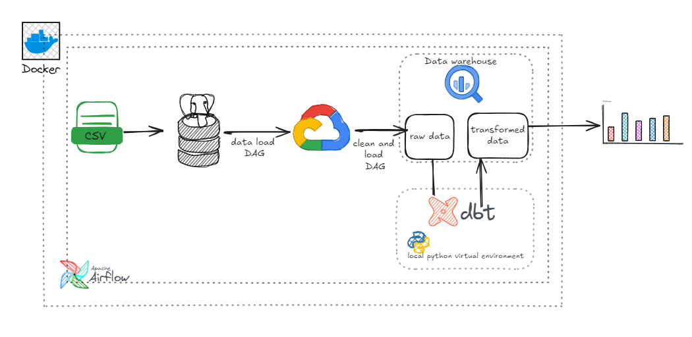

# End-to-End ETL Process with PostgreSQL, Docker, Airflow, dbt, and BigQuery
## Project Overview
This project involves developing an end-to-end ETL process using the *[Brazilian E-Commerce dataset](https://www.kaggle.com/datasets/olistbr/brazilian-ecommerce)* from Kaggle to help end users answer analytical questions. The project demonstrates the use of tools like PostgreSQL, Docker, Docker Compose, Apache Airflow, dbt, and Google BigQuery.




## Prerequisites
- Docker and Docker Compose
- Google Cloud account with BigQuery and Cloud Storage enabled
- Apache Airflow
- PostgreSQL
- Python 3.8+
- dbt (Data Build Tool)

## Project Structure
- DAG File: pg_to_gcs_.py contains the DAG definition for the ETL pipeline.
- Environment File: .env contains all the environment variables required for the pipeline.
- Data Folder: Contains the raw CSV files.
- Docker Compose File: docker-compose.yml sets up the required services (PostgreSQL, Airflow).

## Environment Variables
```
BQ_CONN_ID="your google cloud airflow connection id"
BQ_PROJECT="your project name"
BQ_DATASET="bigquery dataset name"
BQ_TABLES="all your tables separated by a comma"
BQ_BUCKET="your cloud bucket name"
PG_CONN_ID="your postgresql airflow connection id"
PG_SCHEMA="schema name"
PG_TABLES=" your postgresql tables separated by a comma"
CSV_FILENAMES="your csv files name (.csv) separated by a comma"
_PIP_ADDITIONAL_REQUIREMENTS=
```

## Step 1: Data Ingestion into PostgreSQL
- Download the Dataset: *[Brazilian E-Commerce dataset](https://www.kaggle.com/datasets/olistbr/brazilian-ecommerce)*
- Setup PostgreSQL Database using Docker and Docker Compose in the `postgresql-docker-init folder`

The folder contains the following;
 + data: this folder contains the CSV file to be loaded into the ecommerce database.
 + infra-scripts: this folder contains the SQL script to initialize the database schema, create tables, and load the data.
 + docker-compose.yml: the docker Compose configuration file to set up the PostgreSQL container. It defines the PostgreSQL service, setting up the environment variables, ports, and volumes.

## Step 2: Setting up Apache Airflow
- Configure the docker-compose.yml file to include Airflow
- Run docker-compose up -d to start Airflow.This sets up airflow and its dependencies.
- Set up Airflow connections via the Airflow UI or directly in the airflow.cfg file for Postgresql and Google Cloud.

## Step 3: Develop the ETL Pipeline
- Create a DAG (pg_to_gcs_.py) to orchestrate the ETL workflow. The DAG (pg_to_gcs_.py) was created to manage the ETL process, consisting of three main stages:
    + Extract Data from PostgreSQL: Used the PostgresToGCSOperator to extract data from the PostgreSQL tables and save it as CSV files in GCS.
    + Clean CSV Files: Used a PythonOperator to clean the some CSV files by dropping columns not needed and load clean data into bigquery
    + Load Data to BigQuery: Used the GCSToBigQueryOperator to load the CSV files from GCS into BigQuery.
- Define the appropriate schema for your BigQuery tables based on the data types

## Step 4: Running the Pipeline
- Use Docker Compose to start Airflow and PostgreSQL services.
    ```
    docker-compose up -d
    ```
- Access the Airflow UI at http://localhost:8080 or via CLI. Login on the UI with the username and password configured in the docker-compose file.
- Trigger the DAG in Airflow UI manually. This loads all the necessary files in bigquery.
## Step 5: Transforming and Modeling Data with dbt 
- Set Up dbt Project:
Initialize a new dbt project 
- Configure your profiles.yml file to connect to BigQuery using the provided credentials.
- Define the models to transform the raw data
- Configure the schema for your models
- run dbt models


